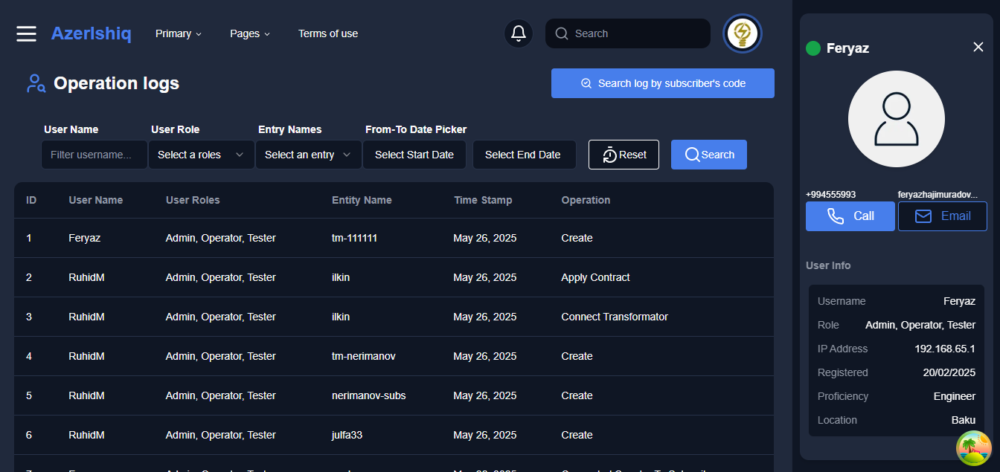
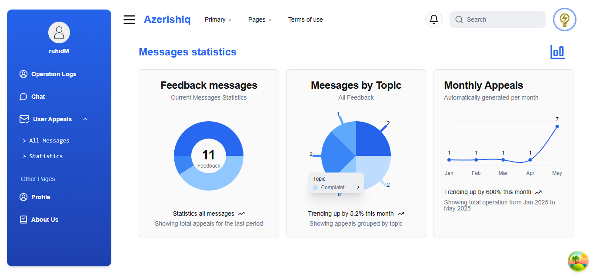
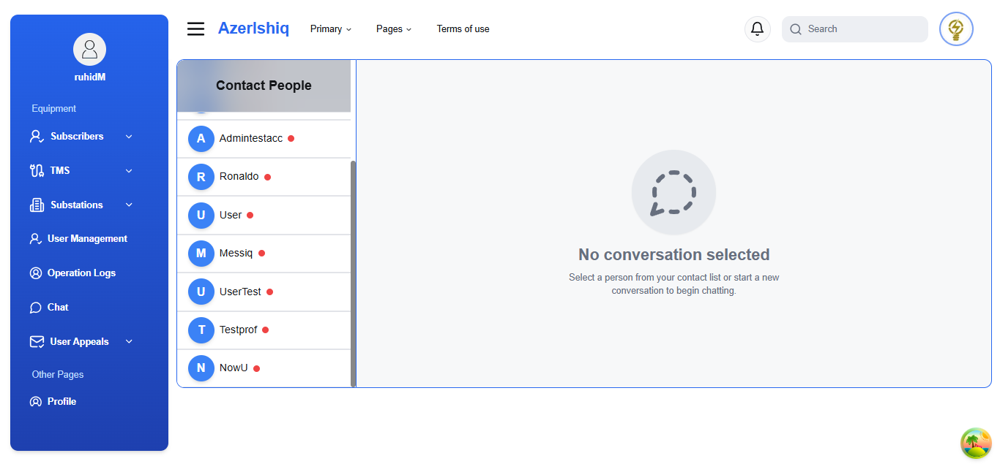
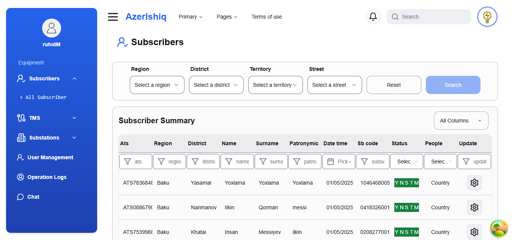
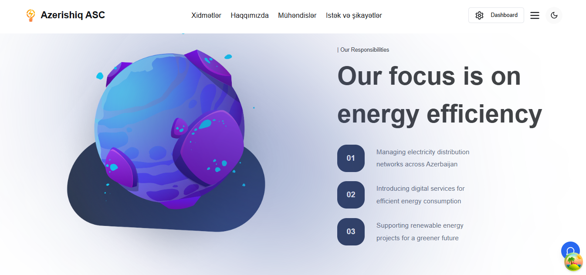

# ⚡ AzeriHiq Admin Panel (Client Side)

## A powerful and responsive **Admin Panel** built using **Next.js** and **TypeScript** to manage internal electrical system data such as **transformers**, **substations**, **users**, and **activity logs**. The panel interfaces with a `.NET` backend for real-time data operations.

## 🖼️ Screenshots

### 📍 Main Route Overview









### 📁 Public Route Folder View



---

## 🚀 Features

- 🔒 **Authentication System**
- ⚡ **Transformer (TM) Monitoring**
- 🏭 **Substation Management**
- 👥 **User and Role Management**
- 📝 **Activity Log Review**
- 💬 **Live Chat Integration (Real-Time)**
- 📮 **User Feedback Module**
- 🎨 **Dark & Light Theme Support**
- 🌐 **Multilingual Support (Planned)**
- 🗺️ **Map System for Visual Monitoring**
- ⚡ **Dynamic Loading for Performance Optimization**

---

## 🧱 Project Structure

````bash
src/
├── app/
│   ├── (auth)/                # Login & Register pages
│   ├── (main)/                # All admin modules
│   │   ├── about/
│   │   ├── chat/
│   │   ├── documentation/
│   │   ├── engineers/
│   │   ├── operation-logs/
│   │   ├── rules/
│   │   ├── subscriber/
│   │   ├── substations/
│   │   ├── tm/
│   │   ├── user-feedback/
│   │   ├── users/
│   │   └── users-management/
├── components/                # UI components
├── hooks/                     # Custom React hooks
├── lib/                       # Context, API utils, helpers
├── public/                    # Static files, images
├── styles/                    # Tailwind CSS
├── ReactQueryProvider.tsx     # React Query setup

## 🔧 Installation Guide

### 1. Backend (.NET) Setup

Make sure your backend server is running on your local machine or a network-accessible IP address.
You can learn more about the backend implementation in the official repository:
🔗 [https://github.com/fryzcode/AzerIsiq](https://github.com/fryzcode/AzerIsiq)

Start the backend server:

```bash
dotnet run


### 1. Frontend (Next.js) Setup
git clone https://github.com/mruhid/azer-ishiq-client.git
cd azer-ishiq-client
npm install --legacy-peer-deps

### 3. Environment Configuration

Create a `.env` file in the root of your project and add the following environment variables:

```env
NEXT_PUBLIC_BACKEND_URL=http://<your-device-ip>/api
NEXT_PUBLIC_BACKEND_URL_CHAT=http://<your-device-ip>/chat
SECRET_KEY=DkQ1skvWq62SeMUvGbLG7Q==DkQ1skvWq62SeMUvGbLG7Q==
NEXT_PUBLIC_IMAGE_HOST=http://<your-device-ip>

### 4. Start the Development Server

```bash
npm run dev

## ⚙️ Built With

- Next.js  
- React 19 (React & React DOM)  
- TypeScript  
- Tailwind CSS (+ tailwind-merge, tailwindcss-animate)  
- React Query (@tanstack/react-query & devtools)  
- Context API & Zustand (state management)  
- React Hook Form & Zod (form handling & validation)  
- RESTful API (ASP.NET Core backend)  
- SignalR (@microsoft/signalr) for real-time communication  
- Map Libraries: Leaflet & React-Leaflet, Mapbox GL, React Map GL  
- UI Components: Radix UI (Checkbox, Dialog, Dropdown, Tabs, Toast, Tooltip, etc.)  
- Framer Motion (animations)  
- Recharts (charts & graphs)  
- Embla Carousel (carousel/sliders)  
- JOSE (JWT/crypto)  
- Ky (HTTP client)  
- Lucia (auth system)  
- Lucide React (icons)  

---

## 📈 Future Plans

- 🌐 Internationalization (i18n)  
- 📎 File upload support (possibly with react-cropper)  
- 🔔 Admin notifications  
- 🧠 Real-time updates via WebSocket / SignalR  
- 🗺️ Enhanced map system features using Mapbox GL and Leaflet  
- ⚡ Performance optimizations with dynamic loading and intersection observers  

---


## 👤 Author

**Ruhid Mammadzade**
Frontend / Next.js, Rect.js, Vue.js
**Faryaz Hajimuradov**
Backend / .Net

📫 [My Portfolio](https://my-gallery-indol.vercel.app/)
🔗 [LinkedIn](https://www.linkedin.com/in/ruhid-mammadzade/)


